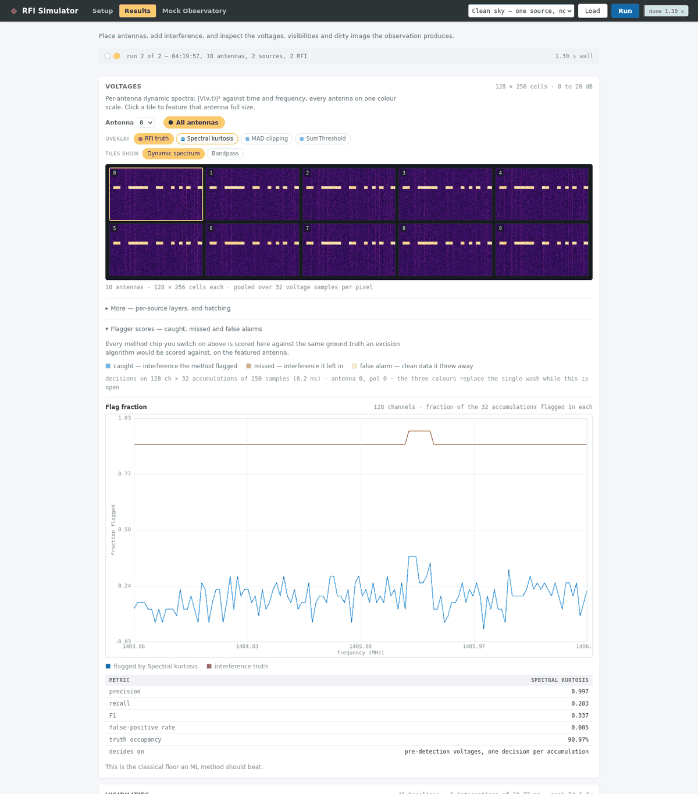
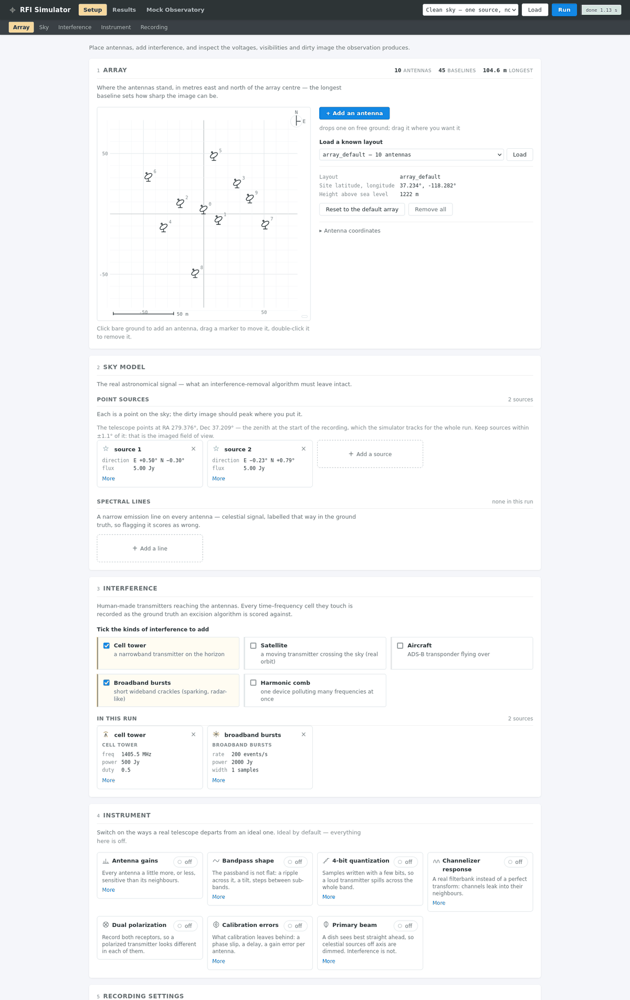
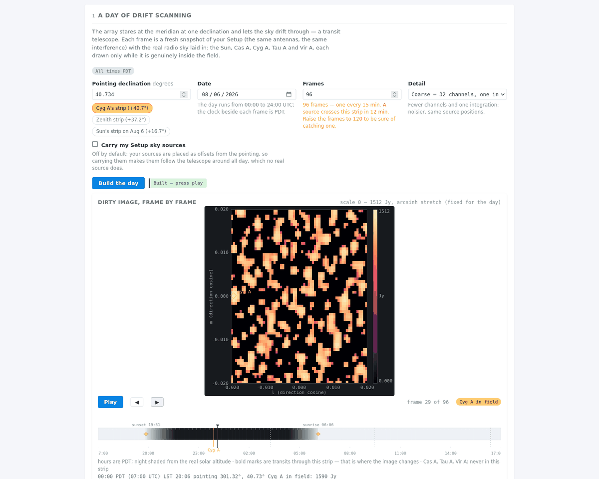

# rfi_simulator

Tools for simulating radio-frequency interference (RFI) in radio-interferometric data.

Simulates a small, configurable antenna array observing celestial sources, with RFI injected at the voltage level and propagated through channelization, correlation, and imaging. Currently implemented: point-source sky model, geometric delay tracking, FX correlation, dirty imaging, and a library of RFI sources — narrowband stationary transmitters, broadband impulsive events, harmonic combs from a single device, TLE-driven satellites (with Doppler and near-field geometry), and ADS-B aircraft — each carrying ground-truth time–frequency contamination labels through every stage. Interference can be made to look the way it does in practice: uneven per-antenna coupling (uniform, an explicit measured pattern, or a lognormal draw), constant-envelope phase-modulated carriers as well as noise-like modulation, and clocked on/off frames or regular pulse trains as well as random ones — each with its own ground truth. The receiver chain can be made non-ideal too: optional per-antenna complex gains (amplitude scatter, phase offsets, smooth bandpass ripple) and optional 4-bit voltage quantization, both reported as ground truth alongside the data. A celestial spectral-line foreground (e.g. a Galactic HI-line bump) can be added too, labelled with its own ground truth kept separate from the interference labels, so a benchmark does not end up rewarding an algorithm for flagging real sky signal. The signal chain itself can be made progressively more realistic, each effect behind its own switch so the ideal first-principles instrument is always one configuration away: a polyphase filterbank channelizer response (temporal memory, adjacent-channel coherence, spectral leakage — so narrowband carriers can sit anywhere in frequency, not just at channel centres), dual polarization with per-source polarization states (polarized transmitters against unpolarized sky — the contrast polarization-based excision algorithms rely on), a calibration-error model (residual per-antenna phase/delay/amplitude errors applied to the visibilities the way an imperfect pipeline would, recorded as recoverable ground truth), large-scale bandpass slopes and per-subband sensitivity scatter, and Gaussian or Airy primary beams attenuating off-centre celestial sources. Simulated voltages can also be written to and read back from a compact packed 4-bit complex on-disk format (`rfi_simulator.io`) with a fully parameterized block layout and validated quantization helpers, for interoperability with beamformer-style voltage capture pipelines. Also included are classical flagging baselines (spectral kurtosis, robust sigma clipping, SumThreshold) and the metrics to score any predicted flag mask against those labels.

## Quickstart

```python
import numpy as np
from astropy.time import Time

from rfi_simulator import (
    ArrayConfig, PointSource, VoltageSimulator, correlate, dirty_image, earth_location, zenith_coord,
)

array = ArrayConfig.from_yaml("configs/array_default.yaml")
t0 = Time("2026-07-30T06:00:00")
phase_center = zenith_coord(earth_location(array), t0)  # phase up on the zenith
source = PointSource.from_lm(phase_center, lm=(0.0087, -0.0052), flux_jy=5.0)

sim = VoltageSimulator(array, phase_center, t0, [source], rng=np.random.default_rng(42))
vis = correlate(sim.blocks())            # ~2 s of data, 45 baselines, 384 channels
image, l_grid, m_grid = dirty_image(vis)

peak = np.unravel_index(np.argmax(image), image.shape)
print(f"peak {image[peak]:.2f} Jy at l={l_grid[peak[1]]:+.4f}, m={m_grid[peak[0]]:+.4f}")
# -> peak 4.82 Jy at l=+0.0086, m=-0.0054
```

## Flagging baselines and scoring

Three classical, non-learned flaggers ship with the library, together with the scoring needed to compare any predicted mask against the simulator's ground truth. Flaggers take plain arrays and never see the labels; masks are boolean with `True` = contaminated.

```python
import numpy as np
from rfi_simulator import (
    flag_scores, mad_clip_mask, pool_truth_accumulations,
    spectral_kurtosis_mask, sumthreshold_mask,
)

block = next(sim.blocks())
voltages = block.data[0]                      # one antenna, (n_chan, n_time)
truth = block.rfi_mask.any(axis=0)            # union over interference sources

# Spectral kurtosis works pre-detection, on accumulations of M time samples,
# so its mask is coarser in time than the labels. `pool_truth_accumulations`
# puts the truth on exactly that grid — including dropping the tail of fewer
# than M samples, about which the flagger reached no decision.
mask = spectral_kurtosis_mask(voltages, m=256)
print(flag_scores(mask, pool_truth_accumulations(truth, m=256)))

# Robust per-channel clipping of the detected power, and the run-finding
# SumThreshold algorithm on its noise-normalized residual. Both decide at
# full resolution, so they score against the labels directly.
power = np.abs(voltages) ** 2
clipped, deviation = mad_clip_mask(power, n_sigma=5.0, return_statistic=True)
runs = sumthreshold_mask(deviation, chi_1=6.0)
print(flag_scores(runs, truth))   # precision, recall, f1, mcc, false-positive rate, ...
```

## Web interface

An interactive browser UI for exploring the simulator, built as a thin layer over the library. It has three tabs. Setup and Results are fully offline: every asset is served from this process and every computation runs locally, nothing leaves the machine.

```bash
pip install -e '.[webui]'
rfi-simulator-ui --port 8765   # then open http://127.0.0.1:8765
```



**Setup** is where the observation is built: an array editor with a clickable site plan of dish markers, presets for common layouts, and compact cards for adding sky sources and each kind of interference (a narrowband tower, a satellite pass, an aircraft, broadband bursts, a harmonic comb). Instrument imperfections — antenna gains, bandpass shape, quantization, channelizer response, dual polarization, calibration errors, primary beam — are each an explicit toggle, all off by default so the ideal instrument is always one switch away.



**Results** shows the run at three levels: per-antenna dynamic spectra and bandpass after channelization, visibility amplitudes and per-baseline spectra after correlation, and the dirty image with its uv coverage. Ground-truth interference and spectral-line masks can be overlaid at every level, alongside chips for the classical flaggers (spectral kurtosis, sigma clipping, SumThreshold) scored against that same ground truth.

**Mock Observatory** turns the same setup into a day of drift-scan data: a frame-by-frame movie of the dirty image as the sky transits a fixed declination, built in parallel and scrubbable on a 24-hour timeline that marks when a real source is in the field, plus a live sky monitor charting what is actually above the site right now — ephemeris, satellites, and aircraft — that degrades gracefully to ephemeris-only when offline.



The Mock Observatory's live sky monitor is the one part of this interface that is not offline: while that tab is open, the page polls the server every few seconds for what is overhead right now, and the server in turn queries a public ADS-B aggregator ([adsb.lol](https://adsb.lol)) — and, only if explicitly configured with a satellite catalogue group, a TLE service — sending the configured site's coordinates to look up nearby aircraft. Ephemeris (Sun, Moon, the bundled source catalogue) is always computed locally. To avoid the outbound requests entirely: don't open the Mock Observatory tab (the rest of the UI never makes them), or set the environment variable `RFI_SIMULATOR_NO_NETWORK=1` before starting the server, which disables every outbound fetch and lets the live monitor degrade gracefully to its offline layers instead.

Under active development; documentation and datasets will be published as the project matures.

Licensed under the GNU General Public License v3.0 — see [LICENSE](LICENSE).
